# 
**Pemesanan Makanan Online**

# **Pengenalan**
Selamat datang di program Pemesanan Makanan Online!
Program ini dibuat menggunakan konsep Object Oriented Programming (OOP) dan menggunakan bahasa pemrograman Java. Program ini menggunakan basis Command Line Interface (CLI) dan dijalankan melalui terminal.
 

# **UML Program**
Program makanan online ini memiliki 6 class utama. Kelima class tersebut yaitu Admin, Login, Main, Menu, Order, Restaurant. Hubungan antara class-class tersebut dapat dilihat pada Unified Modeling Language (UML) berikut.

 

# **Alur Program**
Alur jalannya program makanan online adalah sebagai berikut. 

**1) Login**  
Peratama pengguna akan dihadapkan dengan tampilan login yang dimana pengguna diminta untuk menginput username dan password. Pada program ini terdapat dua tipe yaitu admin dan customer. Jika pengguna menginputkan [username == customer] dan [password == kelazz] maka program akan berjalan sebagai customer sedangkan ketika pengguna menginputkan[username == evan] dan [password == gacorr] maka program akan berjalan sebagai admin.  
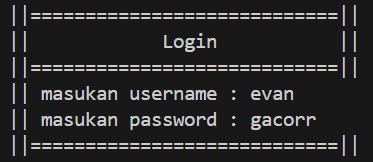 Gambar diatas merupakan tampilan dari menu Login. Dapat dilihat pada gambar, menu pengguna akan diminta untuk memasukkan username dan password.

**2) Admin Menu** 
Ketika pengguna masuk sebagai admin Tampilan awal yang dihadapkan pengguna adalah adalah Admin menu. Pada tahap ini, sebagai admin dapat melihat daftar restoran, menambah restoran, dan menghapus restoran. 
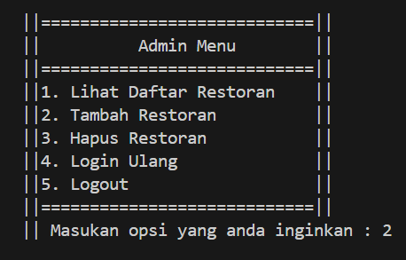 Gambar diatas merupakan tampilan dair menu admin. Pada tahap ini, admin dapat menentukan aksi yang akan dilakukannya.

**3) Lihat Restoran** 
Sebagai seorang Admin dapat melihat restoran apa saja yang telah dimilikinya. 
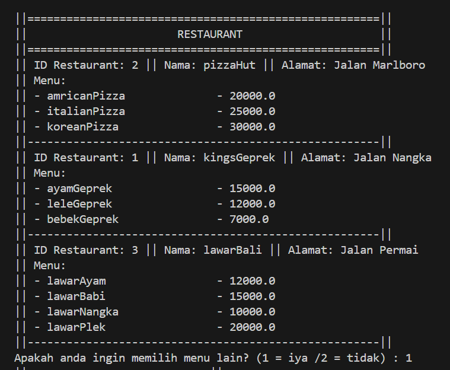  Gambar diatas adalah tampilan saat memilih pilihan lihat restoran. Disini admin dapat melihat semua restoran yang dimilikinya. 

**4) Tambah Restoran** 
Selain melihat restoran, admin juga dapat menambahkan restoran. Pada saat menambah restoran, admin diharuskan untuk menyertakan id restoran nama restoran, dan lokasi dari restoran.  
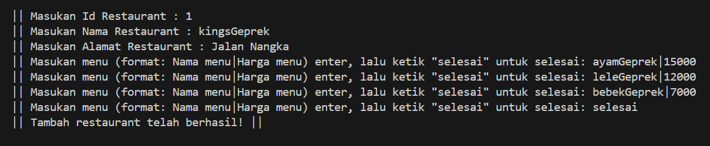 Gambar diatas merupakan tahap dari pilihan tambah restoran. Pada tahap ini, admin diminta untuk memasukkan id restoran, nama restoran, dan lokasi dari restoran.

**5) Hapus Restoran** 
Pilihan terakhir yang tersedia untuk admin adalah menghapus restoran. Tampilan dari tahap ini ketika dijalankan dapat dilihat pada gambar dibawah. 
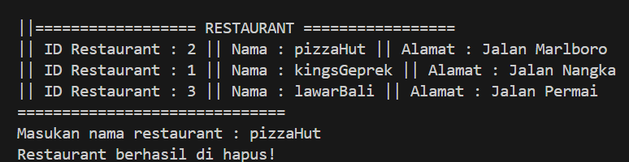 Gambar diatas merupakan tahap dari pilihan hapus restoran. Pada tahap ini, admin memilih pilihan restoran mana yang akan dihapusnya.

**6) Customer** 
Pada bagian ini pengguna akan masuk sebagi customer dengan menginputkan [username == customer] dan [password == kelazz] di bagian login tadi. 
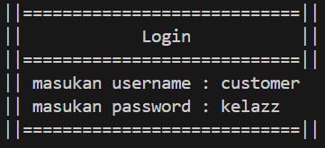  Gambar diatas merupakan username dan password ketika ingin login sebagai customer.  

**7) Menu Customer** 
Pada bagian ini program akan berjalan dan menampilkan menu customer. Tahap ini customer dapat Order makanan/minuman, Lihat pesanan Tampilan dari menu customer dapat dilihat pada gambar dibawah ini. 
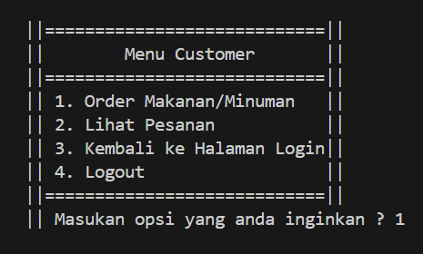  Gambar diatas merupakan tampilan dari menu customer.  

**8) Melakukan Pemesanan** 
pada bagian ini sebagai custoer dapat membuat suatu pesanan. Awalanya, customer akan diminta untuk memilih akan memesan dari restoran mana dengan menginputkan nama restoran. 
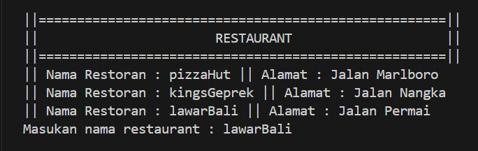 
Setelah memilih restoran, customer dapat melihat menu apa saja dari restoran yang dipilihnya dan juga dapat memilih menu apa yang akan dipesan dan jumlah yang dipesan. 
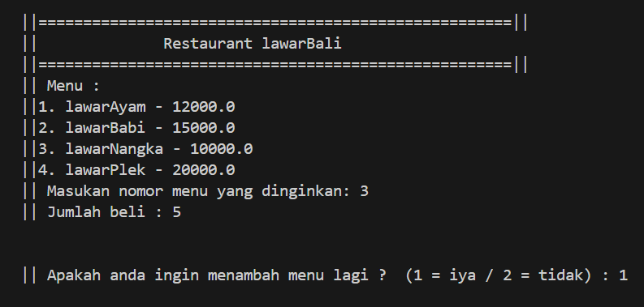 
Setelah memilih menu yang tersedia, customer dapat memberi tahu jarak pengantaran dari restoran dengan lokasi ia bearada pada saat ini dalam(km). 
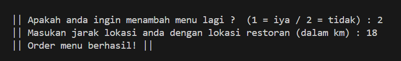 
Setelah memilih menu yang akan dipesan,customer dapat memilih untuk menambah menu yang lain yang dinginkan customer atau melanjutkan ke tahap checkout. Jika customer memilih tambah pesanan, maka akan mengulang proses pada gambar diatas. dan customer juga akan diminta untuk menginputkan jarak pengantaran dari titik customer berada ke lokasi restoran

**9) Melihat Pesanan** 
pada bagian ini sebagai customer dapat melihat pesanan apa saja yang sudah di beli dan total pembayaran yang harus dibayar customer.
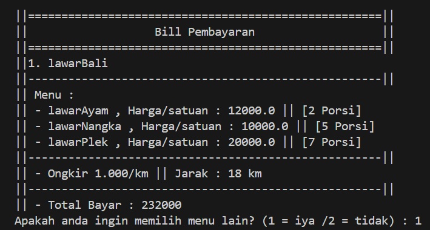
